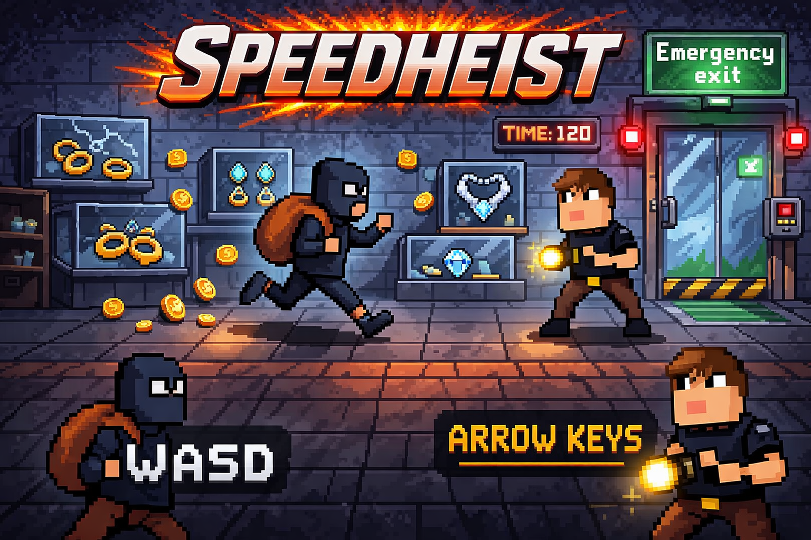
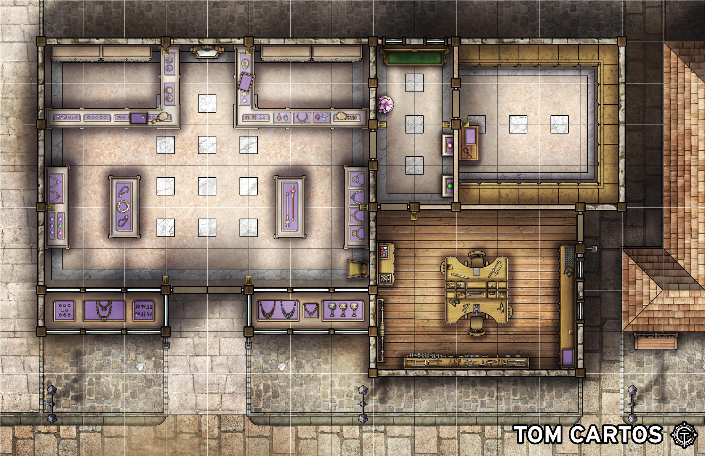

# ⍩⃝-GD-M3-Pacman-Game(Speedheist)

# 📝Game Instructions/Information:
In Speedheist your goal is to steal all the coins and jewels in the jewelry store while escaping the security gaurd that wants to catch you. Everytime you steal a jewel the securtity gaurd will get a little bit faster and if he catches you, you lose the game and have to start over. If you manage to steal all the coins and jewels without getting caught, you can escape the jewelry store by using the emergency exit that automatically opens after stealing all jewels and collecting all the coins. The reward for collecting a coin is 1 point and the reward for stealing a jewel is from the range of 10 to 1000 points, in the  first level you will be stealing 4 golden rings worth 10 points each, in the second level you will be stealing 2 expensive wathces worth 100 points each, in the third level you will be stealing 2 expensive diamond necklaces worth 500 points each and in the fourth level you will be stealing 1  worth 1000 points, but it will become harder to steal as you reach higher levels. There also is a timer that counts down from 120 seconds, if the timer reaches 0 before you steal all the coins and jewels the cops show up and surround the jewelry store and you will be arrested and lose the game and the security gaurd wins. The game  will be playable on one keyboard with the thief using the WASD keys and the security gaurd using the arrow keys, both players can use a special ability that they can unlock later in the game to help them win for the thief using E and for the security gaurd using Slash.
## 💻🥷🏻Controls Thief:
* W - Move Up
* A - Move Left 
* S - Move Down
* D - Move Right
* E - Special Ability/You can unlock a special ability to help you escape (will be added later in the game)
## 💻🧑‍💼Controls Security:
* Arrow Up - Move Up
* Arrow Left - Move Left
* Arrow Down - Move Down
* Arrow Right - Move Right
* Slash - Special Ability/You can unlock a special ability to help you catch the thief (will be added later in the game)
# 🥊🪄Special Abilities: (will be added later in the game)
## 🥷🏻Thief:
* invincebility - will make you invincible for 5 seconds and you can use it to escape the security gaurd if he is chasing you.
* Walldash - will make you dash through a wall once to escape the security gaurd if he is chasing you.
## 🧑‍💼Security:
* Speedboost - will make you faster for 5 seconds and you can use it to catch the thief.
* Trap - will place a trap on the floor that will slow down the thief if he steps on it.
* Walldash - will make you dash through a wall once to catch the thief.
# 🌟📒Patch Notes:

🌟v1.0

* Initial release of the game with basic mechanics and controls.
* Added 4 levels with increasing difficulty and different jewels to steal.
* Added a timer that counts down from 120 seconds.
* Added a playable security guard that chases the thief and gets faster with every jewel stolen.

🌟v1.1

* comming soon...

# 📖Others:

💡Ideas/Examples

* Our example image for the game:

📈Trello

[Trello Board](https://trello.com/b/kZCdiARe/sd1a-gd-pacmangame-julian%F0%9F%A4%9Dalysha)

  
  
  
  
  
  
  

